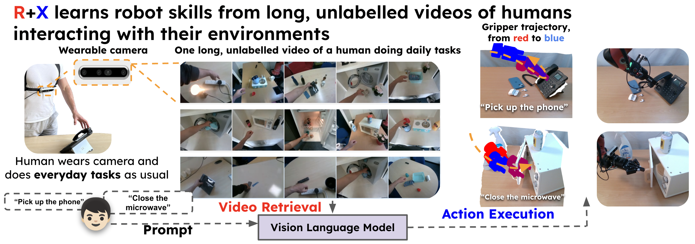

## 🦾 R+X:  Retrieval and Execution from Everyday Human Videos
## 🎥 Extracting robotic actions from human video demonstrations



This repository provides the code used to extract robot actions given a human video demonstration for the paper **R+X:  Retrieval and Execution from Everyday Human Videos** [[paper](https://arxiv.org/abs/2407.12957)]. R+X is divided into a Retrieval and an Execution phase. The execution phase leverages the actions extracted from the human videos to execute tasks zero-shot in new settings. R+X's execution phase relies on Keypoint Action Tokens (KAT). For code on KAT please refer to: [colab](https://colab.research.google.com/drive/1ZxZDahvLBE2EGo8_98Lk0Zr8IvUIDjMc?usp=sharing). This is a simplified version in that it is not optimised to process large scale video datasets in parallel, instead it sequentially processes each frame in a video, runs on cpu (apart from the hand-tracking model) and acts as a good starting point demonstrating how to extract actions from human videos. We provide one video of the "grasp franta" and "pick up phone" tasks used in our experiments. Even though our experiments involved a human recording videos while moving, here we provide an example with a moving camera and one with a static camera each with different intrinsics.

### 📋 Installation

Download repository:

```bash
git clone https://github.com/gpapagiannis/r-plus-x-hand2actions.git
cd r-plus-x-hand2actions
```

Create a conda environment. Needs python >= 3.10:

```bash
conda env create -f conda_env.yaml
conda activate rpx
```

Install requirements.txt

```bash
pip install -r requirements.txt
```

- **Install** HaMeR for hand tracking. Follow the instructions in [https://github.com/geopavlakos/hamer](https://github.com/geopavlakos/hamer) 
- After installing HaMeR, go to:  **_DATA > hamer_ckpts > model_config.yaml**. Then in the model_config.yaml set: **FOCAL_LENGTH = 918**. This ensures compatibility with the camera intrinsics used for the provided examples. We will fix that soon to be set automatically given any intrinsics matrix. 
- After installing HaMeR, **replace** the renderer.py file in "hamer/hamer/utils/renderer.py" with the renderer.py provided here [renderer.py](renderer.py) 
- **Install** the Pytorch implementation of MANO hand model [https://github.com/otaheri/MANO](https://github.com/otaheri/MANO) 


### 👟 Running the code ...

The whole method is contained in [video_to_gripper_hamer_kpts](video_to_gripper_hamer_kpts.py). Just run:

```bash
python video_to_gripper_hamer_kpts.py
```
By default this will extract the actions for the "grasp_fanta" human video demo found [here](./assets/grasp_fanta/). For the pick_up_phone task (and its corresponding intrinsics), as well as to vizualize step by step the hand extraction process see the [global_vars.py](global_vars.py) file.


### ✏️ Important Note

Note: Our method is optimised for the Robotiq Gripper 2F-85 which was used for our experiments. The model we used is in [gripper_point_cloud_dense.npy](gripper_point_cloud_dense.npy). In principle, the heuristics used to map the gripper to the hand could be applied to most parallel jaw gripper, however you would need to manually define the gripper points you would like to map the hand to. We have done this in line 552 of [video_to_gripper_hamer_kpts.py](video_to_gripper_hamer_kpts.py). \

Line 552:

```bash
dense_pcd_kpts = {"index_front": 517980, "thumb_front": 248802, "wrist": 246448}
```

The numbers correspond to the indices of the points in the point cloud: [gripper_point_cloud_dense.npy](gripper_point_cloud_dense.npy). You can vizualize the action extraction process both in our code and by visiting the bottom of our website: [https://www.robot-learning.uk/r-plus-x](https://www.robot-learning.uk/r-plus-x). If you use a different parallel jaw gripper, convert the mesh to a point cloud, select the indices you would like to map from the gripper to the tip of the index, the tip of the thumb and the mean distance between index mcp and the thumb dip of the hand.

### 🎞️ Vizualizing the results

The notebook [vizualizer.ipynb](vizualizer.ipynb) provides minimal code to vizualize the hand to gripper action extraction results. For each task a scene_files folder is created that contains for each video frame, the frame's point cloud, the detected hand mesh, the gripper pose in the camera's frame, the gripper's point cloud and a file hand_joints_kpts_3d.npy that includes the sequence of gripper poses which could be used for further processing to train a model.
